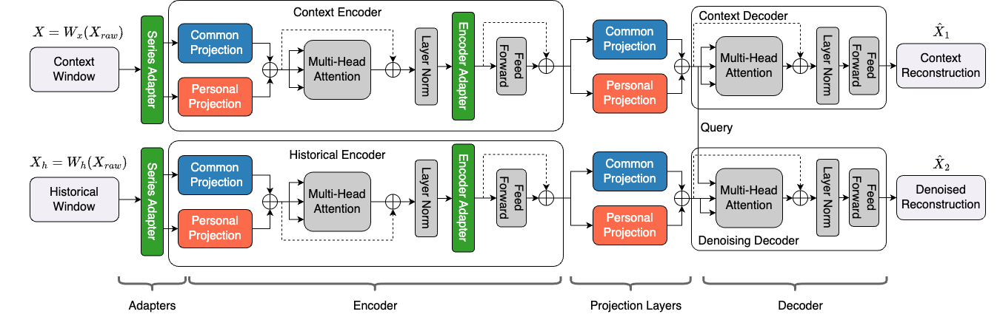

# KAD-Disformer

Welcome to the official GitHub repository for our paper titled **Pre-trained KPI Anomaly Detection Model Through Disentangled Transformer**. In this work, we introduce a novel KPI Anomaly Detection approach leveraging a disentangled Transformer architecture, designed to efficiently and effectively tackle the challenges of anomaly detection in time series data across diverse online service systems.

## Introduction

Online service systems, such as social networks, online shopping platforms, and mobile payment services, are integral to our daily lives. Ensuring the high quality and uninterrupted service of these systems necessitates advanced anomaly detection techniques. Traditional methods, while computationally efficient, often fall short in performance and flexibility. Our work proposes a new model, **KAD-Disformer**, which stands out by offering a universal, pre-trained model capable of unsupervised few-shot fine-tuning to adapt rapidly to new and unseen KPIs without the need for extensive data or time-consuming initialization.

## Key Contributions

- **Pre-trained Time Series-Based KPI Anomaly Detection Model:** Our model is a pioneering pre-trained model in the realm of time series anomaly detection, significantly enhancing the balance between effectiveness and efficiency.
- **Disentangled Projection Matrices:** We introduce a novel approach by disentangling the projection matrices in the Transformer architecture into common and personalized projections, enabling a fine balance between maintaining model capacity and achieving quick adaptation to new KPIs.
- **uTune Mechanism:** Our unique unsupervised few-shot fine-tuning mechanism allows for rapid adaptation to new KPIs with minimal risk of overfitting.



## Getting Started
1. Clone the repository:

   ```
   git clone https://github.com/NetManAIOps/KAD-Disformer/tree/main
   ```

2. Install the required dependencies:

   ```
   pip install -r requirements.txt
   ```

## Usage

1. Prepare your dataset in CSV format with columns 'value' and 'label'.

2. Update the `data_dir` variable in `entry.py` to point to the directory containing your dataset files.

3. Run the script:

   ```
   python entry.py
   ```

   This will perform pre-training, fine-tuning, and testing of the KAD_Disformer model on the specified dataset.

4. The script will output the F1 scores.

## Docker Image
To build and run the Docker container:

1. Build the Docker image:

   ```
   docker build -t kad_disformer .
   ```

2. Run the Docker container:

   ```
   docker run -it --rm kad_disformer
   ```
   Note: Make sure to mount the necessary data volumes or copy the required dataset files into the container before running it.


## Disclaimer
The resources, including code, data, and model weights, associated with this project are restricted for academic research purposes only and cannot be used for commercial purposes. The content produced by any version of KAD-Disformer is influenced by uncontrollable variables such as randomness, and therefore, the accuracy of the output cannot be guaranteed by this project. This project does not accept any legal liability for the content of the model output, nor does it assume responsibility for any losses incurred due to the use of associated resources and output results.

## Support

If you encounter any issues or have questions, please raise an issue or submit a pull request.

## Citation

If you find our research useful, please consider citing our paper (citation details to be added upon publication).

